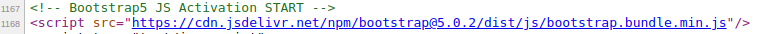

## Adds Bootstrap 5 - Support in Magento2

## Description

This module adds Bootstrap 5 Support in the Default or Active Theme. Bootstrap 5 is the newest version of Bootstrap and is the world's most popular framework for building responsive, mobile-first sites. Bootstrap is an open-source framework that allows you to create responsive, professional-looking websites with ease.

## Features

1. It uses Bootstrap 5 CDN - Reduces Server Load & Offers better performance, reliability, and security.
2. It loads Bootstrap CSS & Js, Only If Enabled from Admin Backend.
3. No Page Slow Loading Issues.
4. Uses minified version of Bootstrap 5 CSS & Js.
5. Open Source - Feel Free to send your suggestions of any changes/improvements, will be happy to add the changes.

## Support:

-   Magento v2.3.x, 2.4.x

## How to install

### Method 1: Install ready-to-paste package

[Download Link - HK2 - Add Boostrap5 - (https://www.techbasant.in/modules/hk2_add_bootstrap5-1.0.0.zip)](https://www.techbasant.in/modules/hk2_add_bootstrap5-1.0.0.zip 'Link')

Download the zip package and unzip it in app/code folder.

## Enable Extension:

```
php bin/magento module:enable HK2_AddBootstrap5

php bin/magento setup:upgrade

php bin/magento setup:static-content:deploy

php bin/magento cache:flush
```

## Disable Extension:

```
php bin/magento module:disable HK2_AddBootstrap5

php bin/magentosetup:upgrade

php bin/magento setup:static-content:deploy

php bin/magento cache:flush
```

## Backend Settings

Login to Magento Admin -> HK2 MENU -> Add Bootstrap5 -> Enable - Yes

Please clear the cache after enabling the option.

Once Installed you can check in frontend - page view page source - Bootstrap is Enabled.

_Note_ :- This module enables Bootstrap CDN in Magento Frontend.


### Method 2: Install via composer (Recommend)

Run the following command in Magento 2 root folder

```
composer require hk2/addbootstrap5
php bin/magento setup:upgrade
php bin/magento setup:static-content:deploy
```

Note: It is always recommended to install and verify the extension first in the development or staging environment and once verified then install it on production environment.

## Maintenance mode

You may want to enable the maintenance mode when installing or updating the module, especially when working on a production website. To do so, run the two commands below before and after running the other setup commands:

### Enable Maintenance Mode

```
php bin/magento maintenance:enable
```

### Disable Maintenance Mode

```
php bin/magento maintenance:disable
```

## Screenshots

1. Admin Panel - Settings
   

2. Boostrap5 CSS - Addition
   

3. Boostrap5 JS - Addition
   
