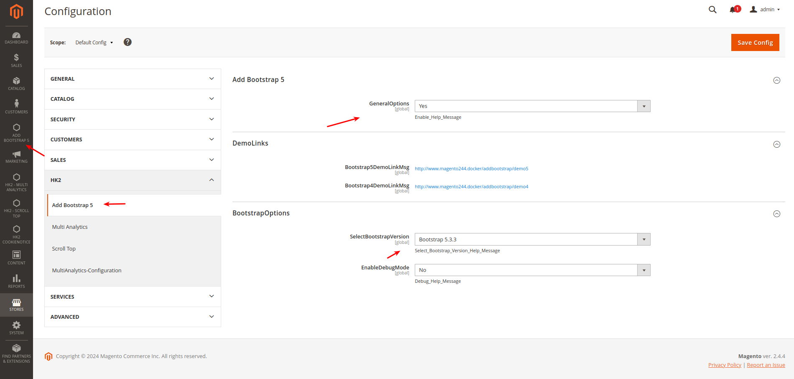

## Adds Bootstrap 5 - Support in Magento2

## Description

HK2 Add Bootstrap 5 Module adds Bootstrap 5 Support in the Default or Active Theme. Bootstrap 5 is the newest version of Bootstrap and is the world's most popular framework for building responsive, mobile-first sites. Bootstrap is an open-source framework that allows you to create responsive, professional-looking websites with ease.

For backward compatibility you can also select Bootstrap 4 from Module Configuration - Available at Magento Admin -> HK2 Add Bootstrap 5.

> Please note:- This Module enables Bootstrap 5 in Magento Frontend not in Admin/Backend.

## Features

1. It uses Bootstrap 5 CDN - Reduces Server Load & Offers better performance, reliability, and security.
2. It loads Bootstrap CSS, Only If Enabled from Admin Backend.
3. No Page Slow Loading Issues.
4. Uses minified version of Bootstrap 5 CSS.
5. Open Source - Feel Free to send your suggestions of any changes/improvements, will be happy to add the changes.
6. Backward Compatibility for Bootstrap 4

## Support:

- Magento v2.3.x, 2.4.x

## Account & Pricing

This is a Open Source - Free to use Module. No charge or any fee is there to use it.

## How to install

### Method 1: Install ready-to-paste package

[Download Link - HK2 - Add Boostrap5 - (https://github.com/basantmandal/HK2-Add_Bootstrap5/releases/tag/2.0.0)](https://github.com/basantmandal/HK2-Add_Bootstrap5/releases/tag/2.0.0)

Download the zip package and unzip it in app/code folder.

## Enable Extension:

```
php bin/magento module:enable HK2_AddBootstrap5

php bin/magento setup:upgrade

php bin/magento setup:static-content:deploy

php bin/magento cache:flush
```

## Disable Extension:

```
php bin/magento module:disable HK2_AddBootstrap5

php bin/magentosetup:upgrade

php bin/magento setup:static-content:deploy

php bin/magento cache:flush
```

## Backend Settings

Login to Magento Admin -> Add Bootstrap5 -> Configuration -> Enable

Please clear the cache after enabling the option.

Once Installed, You can check in Magento Frontend - View Page Source (Right Click - View Page Source) & you can see Bootstrap 5 CDN is Added. Please check the screenshot in case you have any doubts.

Note:- This module enables Bootstrap CDN in Magento Frontend.




### Method 2: Install via composer (Recommend)

Run the following command in Magento 2 root folder

```
composer require hk2/addbootstrap5
php bin/magento setup:upgrade
php bin/magento setup:static-content:deploy
```

Note: It is always recommended to install and verify the extension first in the development or staging environment and once verified then install it on production environment.

## Maintenance mode

You may want to enable the maintenance mode when installing or updating the module, especially when working on a production website. To do so, run the two commands below before and after running the other setup commands:

### Enable Maintenance Mode

```
php bin/magento maintenance:enable
```

### Disable Maintenance Mode

```
php bin/magento maintenance:disable
```

## Screenshots

1. Admin Panel - Settings
   

2. Boostrap5 CSS - Addition
   

3. Boostrap5 Demo
   

4. Boostrap4 Demo
   

# Composer Package Link

https://packagist.org/packages/hk2/addbootstrap5

## Support

For support, Please consult the documentation for each Docker Image. For Bug reporting and feedback about the provided Dockerfiles, Please open an [issue](https://github.com/basantmandal/HK2-Add_Bootstrap5/issues) on GitHub. When filing a bug remember that the better written the bug is, the more likely it is to be fixed.

You can also reach us at <support@hashtagkitto.co.in>

## Contributing

This project welcomes contributions from the community. Before submitting a pull request, please review our contribution guide

## License

Copyright (c) 2019, 2023 **Basant Mandal (HK2 - Hash Tag Kitto)**

## Consent

By using HK2 Magento Module, you hereby consent to our disclaimer and agree to its terms.

## Disclaimer

> **Basant Mandal (HK2 - Hash Tag Kitto)** does not make any warranties about the completeness, reliability and accuracy of this image or its related products. Any action you take upon the information you find here is strictly at your own risk.

> **Basant Mandal (HK2 - Hash Tag Kitto)** will not be liable for any losses and/or damages in connection with the use of our website.
